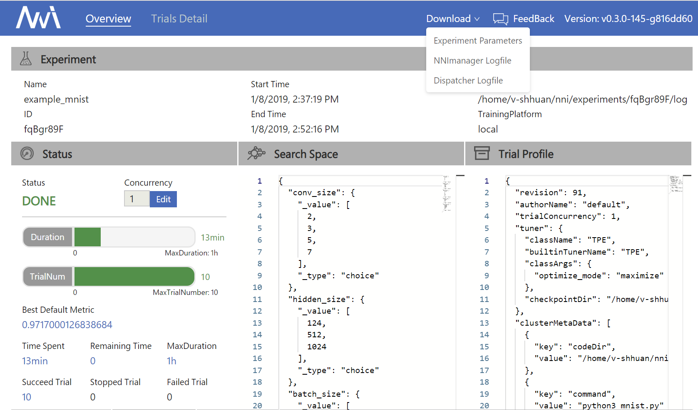
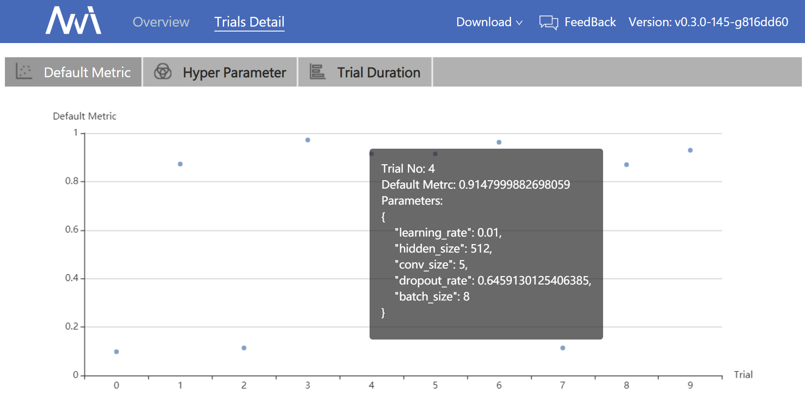
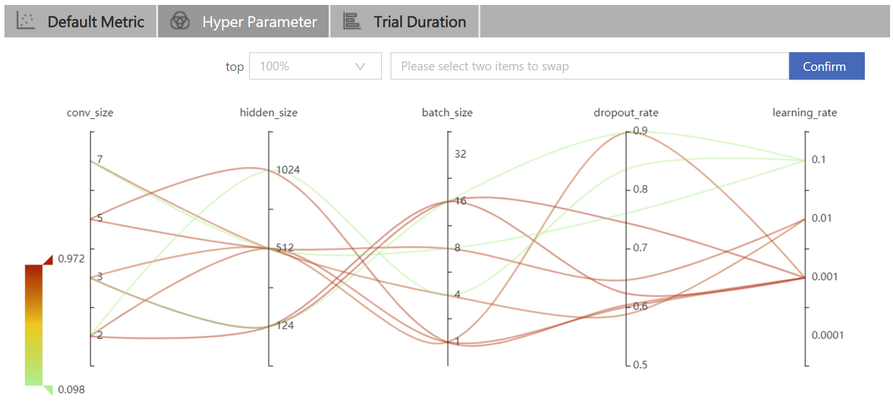
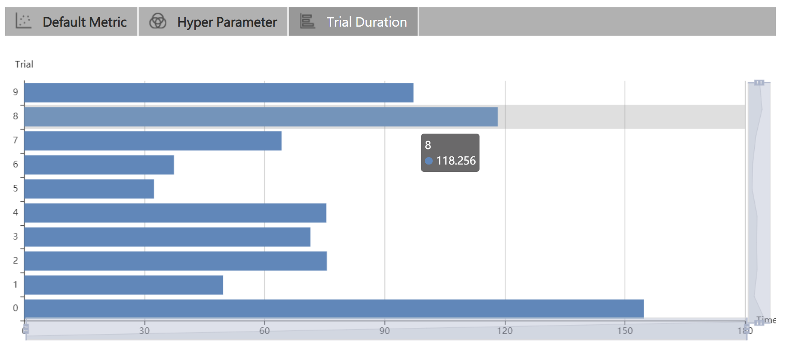
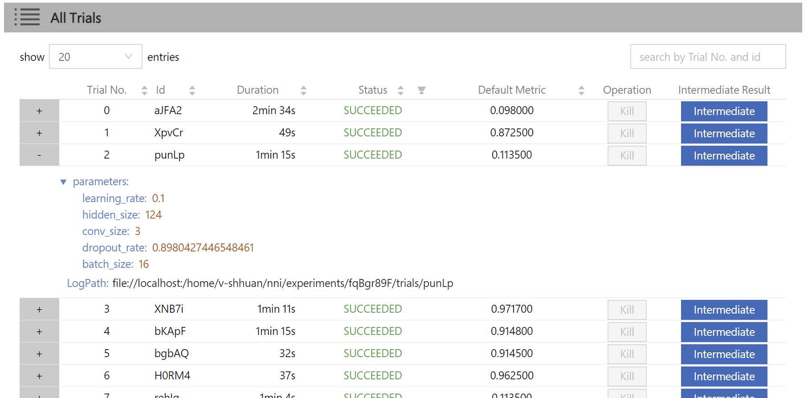
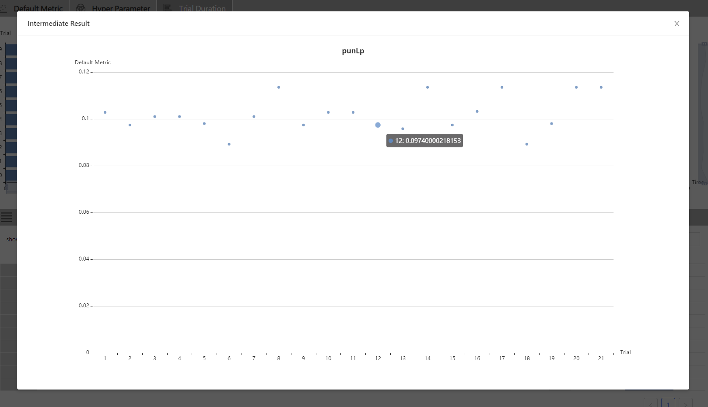

# 快速入门

## 安装

We support Linux MacOS and Windows in current stage, Ubuntu 16.04 or higher, MacOS 10.14.1 and Windows 10.1809 are tested and supported. 在 `python >= 3.5` 的环境中，只需要运行 `pip install` 即可完成安装。

#### Linux 和 MacOS

```bash
    python3 -m pip install --upgrade nni
```

#### Windows

If you are using NNI on Windows, you need run below PowerShell command as administrator at first time.

```bash
    Set-ExecutionPolicy -ExecutionPolicy Unrestricted
```

然后通过 pip 安装 NNI：

```bash
    python -m pip install --upgrade nni
```

注意：

* 在 Linux 和 MacOS 上，如果要将 NNI 安装到当前用户的 home 目录中，可使用 `--user`，则不需要特殊权限。
* 如果遇到如`Segmentation fault` 这样的任何错误请参考[常见问题](FAQ.md)。
* 参考[安装 NNI](Installation.md)，来了解`系统需求`。

## MNIST 上的 "Hello World"

NNI 是一个能进行自动机器学习实验的工具包。 它可以自动进行获取超参、运行 Trial，测试结果，调优超参的循环。 下面会展示如何使用 NNI 来找到最佳超参组合。

这是**没有 NNI** 的样例代码，用 CNN 在 MNIST 数据集上训练：

```python
def run_trial(params):
    # 输入数据
    mnist = input_data.read_data_sets(params['data_dir'], one_hot=True)
    # 构建网络
    mnist_network = MnistNetwork(channel_1_num=params['channel_1_num'], channel_2_num=params['channel_2_num'], conv_size=params['conv_size'], hidden_size=params['hidden_size'], pool_size=params['pool_size'], learning_rate=params['learning_rate'])
    mnist_network.build_network()

    test_acc = 0.0
    with tf.Session() as sess:
        # 训练网络
        mnist_network.train(sess, mnist)
        # 评估网络
        test_acc = mnist_network.evaluate(mnist)

if __name__ == '__main__':
    params = {'data_dir': '/tmp/tensorflow/mnist/input_data', 'dropout_rate': 0.5, 'channel_1_num': 32, 'channel_2_num': 64, 'conv_size': 5, 'pool_size': 2, 'hidden_size': 1024, 'learning_rate': 1e-4, 'batch_num': 2000, 'batch_size': 32}
    run_trial(params)
```

注意：完整实现请参考 [examples/trials/mnist/mnist_before.py](https://github.com/Microsoft/nni/tree/master/examples/trials/mnist/mnist_before.py)

上面的代码一次只能尝试一组参数，如果想要调优学习率，需要手工改动超参，并一次次尝试。

NNI 用来帮助超参调优。它的流程如下：

```pseudo
输入: 搜索空间, Trial 代码, 配置文件
输出: 一组最优的参数配置

1: For t = 0, 1, 2, ..., maxTrialNum,
2:      hyperparameter = 从搜索空间选择一组参数
3:      final result = run_trial_and_evaluate(hyperparameter)
4:      返回最终结果给 NNI
5:      If 时间达到上限,
6:          停止实验
7: 返回最好的实验结果
```

如果需要使用 NNI 来自动训练模型，找到最佳超参，需要如下三步：

**使用 NNI 时的三个步骤**

**第一步**：定义 JSON 格式的`搜索空间`文件，包括所有需要搜索的超参的`名称`和`分布`（离散和连续值均可）。

```diff
-   params = {'data_dir': '/tmp/tensorflow/mnist/input_data', 'dropout_rate': 0.5, 'channel_1_num': 32, 'channel_2_num': 64,
-   'conv_size': 5, 'pool_size': 2, 'hidden_size': 1024, 'learning_rate': 1e-4, 'batch_num': 2000, 'batch_size': 32}
+ {
+     "dropout_rate":{"_type":"uniform","_value":[0.5, 0.9]},
+     "conv_size":{"_type":"choice","_value":[2,3,5,7]},
+     "hidden_size":{"_type":"choice","_value":[124, 512, 1024]},
+     "batch_size": {"_type":"choice", "_value": [1, 4, 8, 16, 32]},
+     "learning_rate":{"_type":"choice","_value":[0.0001, 0.001, 0.01, 0.1]}
+ }
```

*实现代码：[search_space.json](https://github.com/Microsoft/nni/tree/master/examples/trials/mnist/search_space.json)*

**第二步**：修改 `Trial` 代码来从 NNI 获取超参，并返回 NNI 最终结果。

```diff
+ import nni

  def run_trial(params):
      mnist = input_data.read_data_sets(params['data_dir'], one_hot=True)

      mnist_network = MnistNetwork(channel_1_num=params['channel_1_num'], channel_2_num=params['channel_2_num'], conv_size=params['conv_size'], hidden_size=params['hidden_size'], pool_size=params['pool_size'], learning_rate=params['learning_rate'])
      mnist_network.build_network()

      with tf.Session() as sess:
          mnist_network.train(sess, mnist)
          test_acc = mnist_network.evaluate(mnist)

+         nni.report_final_result(acc)

  if __name__ == '__main__':

-     params = {'data_dir': '/tmp/tensorflow/mnist/input_data', 'dropout_rate': 0.5, 'channel_1_num': 32, 'channel_2_num': 64,
-     'conv_size': 5, 'pool_size': 2, 'hidden_size': 1024, 'learning_rate': 1e-4, 'batch_num': 2000, 'batch_size': 32}
+     params = nni.get_next_parameter()
      run_trial(params)
```

*实现代码：[mnist.py](https://github.com/Microsoft/nni/tree/master/examples/trials/mnist/mnist.py)*

**第三步**：定义 YAML 格式的`配置`文件，其中声明了搜索空间和 Trial 文件的`路径`，以及`其它信息`，如调优算法，最大尝试次数，最大运行时间等等。

```yaml
authorName: default
experimentName: example_mnist
trialConcurrency: 1
maxExecDuration: 1h
maxTrialNum: 10
trainingServicePlatform: local
# 搜索空间文件
searchSpacePath: search_space.json
useAnnotation: false
tuner:
  builtinTunerName: TPE
# 运行的命令，以及 Trial 代码的路径
trial:  
  command: python3 mnist.py
  codeDir: .
  gpuNum: 0
```

注意：**在 Windows 上，需要将 Trial 命令的 `python3` 改为 `python`**

*实现代码：[config.yml](https://github.com/Microsoft/nni/tree/master/examples/trials/mnist/config.yml)*

上面的代码都已准备好，并保存在 [examples/trials/mnist/](https://github.com/Microsoft/nni/tree/master/examples/trials/mnist)。

#### Linux 和 macOS

从命令行使用 **config.yml** 文件启动 MNIST Experiment 。

```bash
    nnictl create --config nni/examples/trials/mnist/config.yml
```

#### Windows

从命令行使用 **config_windows.yml** 文件启动 MNIST Experiment 。

**Note**, if you're using NNI on Windows, it needs to change `python3` to `python` in the config.yml file, or use the config_windows.yml file to start the experiment.

```bash
    nnictl create --config nni/examples/trials/mnist/config_windows.yml
```

注意：**nnictl** 是一个命令行工具，用来控制 NNI Experiment，如启动、停止、继续 Experiment，启动、停止 NNIBoard 等等。 查看[这里](Nnictl.md)，了解 `nnictl` 更多用法。

在命令行中等待输出 `INFO: Successfully started experiment!`。 此消息表明 Experiment 已成功启动。 期望的输出如下：

```text
INFO: Starting restful server...
INFO: Successfully started Restful server!
INFO: Setting local config...
INFO: Successfully set local config!
INFO: Starting experiment...
INFO: Successfully started experiment!
-----------------------------------------------------------------------
The experiment id is egchD4qy
The Web UI urls are: [Your IP]:8080
-----------------------------------------------------------------------

You can use these commands to get more information about the experiment
-----------------------------------------------------------------------
         commands                       description

1. nnictl experiment show        show the information of experiments
2. nnictl trial ls               list all of trial jobs
3. nnictl top                    monitor the status of running experiments
4. nnictl log stderr             show stderr log content
5. nnictl log stdout             show stdout log content
6. nnictl stop                   stop an experiment
7. nnictl trial kill             kill a trial job by id
8. nnictl --help                 get help information about nnictl
-----------------------------------------------------------------------
```

如果根据上述步骤准备好了相应 `Trial`, `搜索空间` 和 `配置`，并成功创建的 NNI 任务。NNI 会自动开始通过配置的搜索空间来运行不同的超参集合，搜索最好的超参。 通过 Web 界面可看到 NNI 的进度。

## Web 界面

启动 Experiment 后，可以在命令行界面找到如下的 `Web 界面地址`：

```text
The Web UI urls are: [IP 地址]:8080
```

在浏览器中打开 `Web 界面地址`(即：`[IP 地址]:8080`)，就可以看到 Experiment 的详细信息，以及所有的 Trial 任务。 如果无法打开终端中的 Web 界面链接，可以参考 [FAQ](FAQ.md)。

#### 查看概要页面

点击标签 "Overview"。

Experiment 相关信息会显示在界面上，配置和搜索空间等。 可通过 **Download** 按钮来`下载信息和参数`。 可以在运行中或结束后，随时下载 Experiment 的结果。



前 10 个 Trial 结果也会列在 Overview 页面中，可以在 "Trials Detail" 部分浏览所有的 Trial。


#### 查看 Trial 详情页面

点击 "Default Metric" 来查看所有 Trial 的点图。 悬停鼠标来查看默认指标和搜索空间信息。



点击 "Hyper Parameter" 标签查看图像。

* 可选择百分比查看最好的 Trial。
* 选择两个轴来交换位置。



点击 "Trial Duration" 标签来查看柱状图。



下面是所有 Trial 的状态。 包括：

* Trial 详情：Trial 的 id，持续时间，开始时间，结束时间，状态，精度和搜索空间。
* 如果在 OpenPAI 平台上运行，还可以看到 hdfsLog。
* Kill: 可终止正在运行的任务。
* 支持搜索某个特定的 Trial。



* 中间结果图



## 相关主题

* [尝试不同的 Tuner](BuiltinTuner.md)
* [尝试不同的 Assessor](BuiltinAssessors.md)
* [使用命令行工具 nnictl](Nnictl.md)
* [如何编写 Trial 代码](Trials.md)
* [如何在本机运行 Experiment (支持多 GPU 卡)？](LocalMode.md)
* [如何在多机上运行 Experiment？](RemoteMachineMode.md)
* [如何在 OpenPAI 上运行 Experiment？](PaiMode.md)
* [如何通过 Kubeflow 在 Kubernetes 上运行 Experiment？](KubeflowMode.md)
* [如何通过 FrameworkController 在 Kubernetes 上运行 Experiment？](FrameworkControllerMode.md)